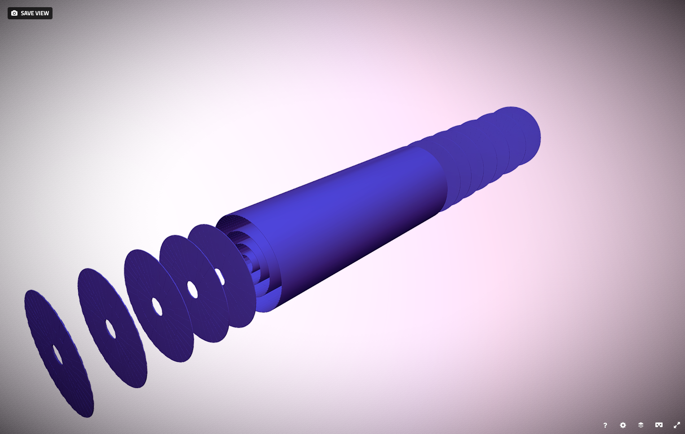

[TOC]

# Framework and Examples

## The framework purpose

*Disclaimer*

The `acts-framework` is not designed for any production purpose, it is simply a helper framework that allows to test code from `acts-core` and `acts-fatras` in a parallel environment. 

### Framework design

The stucture of the `acts-framework` is inspired by Gaudi, but in general very rudimentary. It provides a parallel `Sequencer`, a central store (called `WhiteBoard`) an algorithm sequence and a reader and writer structure. The `Sequencer` calls `execute` on the list of algorithms in the algorithm list.

To allow parallel events to be processed, a dedicated `EventContext` object carries the event number and enforced reproducability concerning random number generation. Readers and writers need to be protected with a `mutex` in such a parallel structure.

The multithreading is based on the `tbb` library, which is a requirement for the `acts-framework`.
The number of threads is steered by the environment variable `ACTSFW_NUM_THREADS`.

### Steering

The steering of examples is done using the `boost_program_options` which are defined for each example, depending on the given functionality. By calling a program with the  `--help` the list of available options is usually printed.


# Examples

## Hello World

The most rudimentary example to run is traditionally the `HelloWorld` example. It demonstrates how to create a simple algorithm,
the `HelloWorld` algorithm which is attached as the single algorithm to the senquencer. For this reason it is explained here in a bit more detail.

``` c++
FW::ProcessCode
FWE::HelloWorldAlgorithm::execute(FW::AlgorithmContext context) const
{
  ACTS_INFO(" Hello World! (from event " << context.eventNumber << ")");
  ACTS_DEBUG("  - that's an ACTS_DEBUG message");
  ACTS_VERBOSE("  - that's an ACTS_VERBOSE message");
  return FW::ProcessCode::SUCCESS;
}
```
 
Here is the full program: it starts with the adding of common program options, such as the number of events and the output log level.
Then, these parameters are read back in from the argument list provided.

A `HelloWorld` algorithm is created and added to the sequencer, and finally the chosen `nEvents` are executed.

 
``` c++
/// Main read evgen executable
///
/// @param argc The argument count
/// @param argv The argument list
int
main(int argc, char* argv[])
{
  // Declare the supported program options.
  po::options_description desc("Allowed options");
  // Add the standard options
  FW::Options::addCommonOptions<po::options_description>(desc);
  // Map to store the given program options
  po::variables_map vm;
  // Get all options from contain line and store it into the map
  po::store(po::parse_command_line(argc, argv, desc), vm);
  po::notify(vm);
  // Print help if reqested
  if (vm.count("help")) {
    std::cout << desc << std::endl;
    return 1;
  }
  // Read the common options
  auto nEvents  = FW::Options::readNumberOfEvents<po::variables_map>(vm);
  auto logLevel = FW::Options::readLogLevel<po::variables_map>(vm);

  // And add the hello world algorithm
  std::shared_ptr<FW::IAlgorithm> hWorld(
      new FWE::HelloWorldAlgorithm(logLevel));

  // Create the config object for the sequencer
  FW::Sequencer::Config seqConfig;

  // Now create the sequencer
  FW::Sequencer sequencer(seqConfig);
  sequencer.appendEventAlgorithms({hWorld});
  sequencer.run(nEvents);
  // Return 0 for success
  return 0;
}
```
Let us first execute the binary with the `--help` option which prints out the available options for this executable.

``` bash
Allowed options:
  --help                     Produce help message
  -n [ --events ] arg (=1)   The number of events to be processed
  -l [ --loglevel ] arg (=2) The output log level. Please set the wished number
                             (0 = VERBOSE, 1 = DEBUG, 2 = INFO, 3 = WARNING, 4
                             = ERROR, 5 = FATAL).
```

Only the number of events and the output log level can be changed for the `HelloWorld` example, which when executed with default parameters yields

``` bash

acts-tester$ ./ACTFWHelloWorldExample

14:38:38    Sequencer      INFO      Appended algorithm HelloWorld
14:38:38    Sequencer      INFO      Starting event loop for
14:38:38    Sequencer      INFO        0 services
14:38:38    Sequencer      INFO        0 readers
14:38:38    Sequencer      INFO        0 writers
14:38:38    Sequencer      INFO        1 algorithms
14:38:38    Sequencer      INFO      Run the event loop
14:38:38    Sequencer      INFO      start event 0
14:38:38    HelloWorld     INFO       Hello World! (from event 0)
14:38:38    Sequencer      INFO      event 0 done
14:38:38    Sequencer      INFO      Running end-of-run hooks of writers and services
```

One can now modify the number of events and the screen output level, e.g. 

``` bash
acts-tester$ ./ACTFWHelloWorldExample -l0
14:39:37    Sequencer      INFO      Appended algorithm HelloWorld
14:39:37    Sequencer      INFO      Starting event loop for
14:39:37    Sequencer      INFO        0 services
14:39:37    Sequencer      INFO        0 readers
14:39:37    Sequencer      INFO        0 writers
14:39:37    Sequencer      INFO        1 algorithms
14:39:37    Sequencer      INFO      Run the event loop
14:39:37    Sequencer      INFO      start event 0
14:39:37    HelloWorld     INFO       Hello World! (from event 0)
14:39:37    HelloWorld     DEBUG       - that is an ACTS_DEBUG message
14:39:37    HelloWorld     VERBOSE     - that is an ACTS_VERBOSE message
14:39:37    Sequencer      INFO      event 0 done
14:39:37    Sequencer      INFO      Running end-of-run hooks of writers and services
```

or (with `export ACTSFW_NUM_THREADS=1`):

``` bash
acts-tester$ ./ACTFWHelloWorldExample -n5
14:41:15    Sequencer      INFO      Appended algorithm HelloWorld
14:41:15    Sequencer      INFO      Starting event loop for
14:41:15    Sequencer      INFO        0 services
14:41:15    Sequencer      INFO        0 readers
14:41:15    Sequencer      INFO        0 writers
14:41:15    Sequencer      INFO        1 algorithms
14:41:15    Sequencer      INFO      Run the event loop
14:41:15    Sequencer      INFO      start event 0
14:41:15    HelloWorld     INFO       Hello World! (from event 0)
14:41:15    Sequencer      INFO      event 0 done
14:41:15    Sequencer      INFO      start event 1
14:41:15    HelloWorld     INFO       Hello World! (from event 1)
14:41:15    Sequencer      INFO      event 1 done
14:41:15    Sequencer      INFO      start event 2
14:41:15    HelloWorld     INFO       Hello World! (from event 2)
14:41:15    Sequencer      INFO      event 2 done
14:41:15    Sequencer      INFO      start event 3
14:41:15    HelloWorld     INFO       Hello World! (from event 3)
14:41:15    Sequencer      INFO      event 3 done
14:41:15    Sequencer      INFO      start event 4
14:41:15    HelloWorld     INFO       Hello World! (from event 4)
14:41:15    Sequencer      INFO      event 4 done
14:41:15    Sequencer      INFO      Running end-of-run hooks of writers and service
```

When increasing the available number of threads, one can see how the events get executed in parallel and the screen print out gets scrambled:

``` bash
acts-tester$ ./ACTFWHelloWorldExample -n5
14:43:23    Sequencer      INFO      Appended algorithm HelloWorld
14:43:23    Sequencer      INFO      Starting event loop for
14:43:23    Sequencer      INFO        0 services
14:43:23    Sequencer      INFO        0 readers
14:43:23    Sequencer      INFO        0 writers
14:43:23    Sequencer      INFO        1 algorithms
14:43:23    Sequencer      INFO      Run the event loop
14:43:23    Sequencer      INFO      start event 2
14:43:23    Sequencer      INFO      start event 3
14:43:23    Sequencer      INFO      start event 0
14:43:23    HelloWorld     INFO       Hello World! (from event 2)
14:43:23    HelloWorld     INFO       Hello World! (from event 3)
14:43:23    Sequencer      INFO      start event 4
14:43:23    Sequencer      INFO      event 3 done
14:43:23    HelloWorld     INFO       Hello World! (from event 4)
14:43:23    Sequencer      INFO      start event 1
14:43:23    HelloWorld     INFO       Hello World! (from event 0)
14:43:23    Sequencer      INFO      event 2 done
14:43:23    Sequencer      INFO      event 4 done
14:43:23    Sequencer      INFO      event 0 done
14:43:23    HelloWorld     INFO       Hello World! (from event 1)
14:43:23    Sequencer      INFO      event 1 done
14:43:23    Sequencer      INFO      Running end-of-run hooks of writers and services
```

## Geometry Building

This example does not run an event loop, it only build the geometry and evokes writers for the output of the geometry into some visualisation format (`.obj`). There are different ways to build an Acts geometry, depending on which input geometry is chosen:

* GenericGeometry, i.e. an adhoc geometry descrbed in `Detectors/GenericGeometry` using an explicit C++ description
* RootGeometry, a TGeo/ROOT based geometry constructed with the `TGeoLayerBuilder` from `acts-core`
* DD4hepGeometry, a TGeo/DD4hep based geometry constructed with the `DD4hepLayerBuilder` from `acts-core`

Let us start with the `ACTFWGenericGeometryExample`, and inspect the options:

``` bash
./ACTFWGenericGeometryExample --help
Allowed options:
  --help                                Produce help message
  -n [ --events ] arg (=1)              The number of events to be processed
  -l [ --loglevel ] arg (=2)            The output log level. Please set the
                                        wished number (0 = VERBOSE, 1 = DEBUG,
                                        2 = INFO, 3 = WARNING, 4 = ERROR, 5 =
                                        FATAL).
  --obj-tg-fileheader arg               The (optional) file header for the
                                        tracking geometry.
  --obj-tg-sensitiveheader arg          The (optional) header in front of
                                        sensitive sensors.
  --obj-tg-layerheader arg              The (optional) header in front of layer
                                        surfaces.
  --obj-sf-fileheader arg               The (optional) file header for the
                                        surface writer.
  --obj-sf-phisegments arg (=72)        Number of phi segments to approximate
                                        curves.
  --obj-sf-outputPrecission arg (=6)    Floating number output precission.
  --obj-sf-outputScalor arg (=1)        Scale factor to be applied.
  --obj-sf-outputThickness arg (=1)     The surface thickness.
  --obj-sf-outputSensitive arg (=1)     Write sensitive surfaces.
  --obj-sf-outputLayers arg (=1)        Write layer surfaces.
  --geo-surface-loglevel arg (=3)       The outoput log level for the surface
                                        building.
  --geo-layer-loglevel arg (=3)         The output log level for the layer
                                        building.
  --geo-volume-loglevel arg (=3)        The output log level for the volume
                                        building.
  --geo-subdetectors arg (= )           Sub detectors for the output writing
  --geo-material-mode arg (=1)          Modes are: 0 (none), 1 (construct), 2
                                        (load), 3 (proto)
  --geo-material-file arg (=material-maps.root)
                                        File for the material maps to be
                                        loaded.
  --output-dir arg                      Output directory location.
  --output-root arg (=0)                Switch on to write '.root' output
                                        file(s).
  --output-csv arg (=0)                 Switch on to write '.csv' output
                                        file(s).
  --output-obj arg (=0)                 Switch on to write '.obj' ouput
                                        file(s).
  --output-json arg (=0)                Switch on to write '.json' ouput
                                        file(s).
```

There are different steering options concering the output, most importantly the `--geo-subdetectors` option that reads the list of sub detectors which should be written out for this detector. The standard `GenericGeometry` is built from a beam pipe, a pixel detector, a pixel support tube, short strips detector (SStrip) and long strings (LStrip), hence we can evoke the following call.

``` bash
./ACTFWGenericGeometryExample  --output-obj 1 --geo-subdetectors BeamPipe Pixel PST SStrip LStrip

```

This creates dedicated `obj` files that can be used for displaying the detector with a standard viewer that can read the `obj` format:

``` bash
-rw-r--r--  1 salzburg  staff    13542 Jan 15 16:59 BeamPipe.obj
-rw-r--r--  1 salzburg  staff  3095801 Jan 15 16:59 LStrip.obj
-rw-r--r--  1 salzburg  staff    13580 Jan 15 16:59 PST.obj
-rw-r--r--  1 salzburg  staff  1963033 Jan 15 16:59 Pixel.obj
-rw-r--r--  1 salzburg  staff  3543361 Jan 15 16:59 SStrip.obj
```

The following is an example of `Pixel.obj` displayed with a standard online obj viewer



										

## Propagation Example


## Material Mapping and Material Validation

### Material Mapping

The `MaterialMapping` example demonstrates how to map and project material information from a complex detector geometry onto a set of chosen layers.

### Material Validation

The `MaterialValidation` example is built upon the `PropagationAlgorithm`: it runs test propagations and records the material inforamtion in the tracker. If configured with the `--root-output 1` option, this iformation is written into a `root` file.


