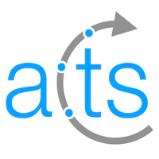

# A Common Tracking Software (ACTS)

1. [Introduction](#introduction)
2. [Repository structure](#repository-structure)
3. [Releases](#releases)
4. [License and authors](#license-and-authors)



# [Latest release: {{ latest_tag.name }}](https://gitlab.cern.ch/acts/acts-core/tags/{{ latest_tag.name }})
{{ latest_tag.commit.authored_date|iso8601|datetime_format("%d %b %Y") }}

- [Download](https://gitlab.cern.ch/acts/acts-core/repository/{{ latest_tag.name }}/archive.tar.gz)
- [Release Notes](https://gitlab.cern.ch/acts/acts-core/tags/{{ latest_tag.name }})
- [Documentation](http://acts.web.cern.ch/ACTS/{{ latest_tag.name }}/doc/index.html)

# Introduction

This project contains an experiment-independent set of track reconstruction tools. The main philosophy is to provide high-level track reconstruction modules that can be used for any tracking detector. The description of the tracking detector's geometry is optimized for efficient navigation and quick extrapolation of tracks. Converters for several common geometry description languages exist. Having a highly performant, yet largely customizable implementation of track reconstruction algorithms was a primary objective for the design of this toolset. Additionally, the applicability to real-life HEP experiments plays major role in the development process. Apart from algorithmic code, this project also provides an event data model for the description of track parameters and measurements.

Key features of this project include:
* tracking geometry description which can be constructed from TGeo, DD4Hep, or GDML input,
* simple and efficient event data model,
* performant and highly flexible algorithms for track propagation and fitting,
* basic seed finding algorithms.

## Mailing list

In order to receive the latest updates, users of the ACTS project are encouraged to subscribe to [acts-users@cern.ch](https://e-groups.cern.ch/e-groups/Egroup.do?egroupName=acts-users). This list provides:

- regular updates on the software,
- access to the [ACTS JIRA project](https://its.cern.ch/jira/projects/ACTS/) for bug fixes/feature requests,
- a common place for asking any kind of questions.

# Repository structure

The repositories for the ACTS project can be found at 
[https://gitlab.cern.ch/acts](https://gitlab.cern.ch/acts)

### acts-core

The [`acts-core`](https://gitlab.cern.ch/acts/acts-core) repository contains the all detector independent software that is part of the ACTS toolkit. 

### acts-fatras

The [`acts-fatras`](https://gitlab.cern.ch/acts/acts-fatras) repository contains the fast track simulation extension of the ACTS toolkit. 
The fast track simulation moduels are currently in  development and available only in a *limited* way.

### acts-data 

The [`acts-data`](https://gitlab.cern.ch/acts/acts-data) repository contains some necessary data files for running the standard ACTS examples.

### acts-framework

The [`acts-framework`](https://gitlab.cern.ch/acts/acts-framework) reposity contains a small event processing framework for development and testing. The framework is capable of parallel event processing if ``OpenMP`` is available on the machine.

ACTS test jobs are run in the framework in the continuous integration, and tested for bit-wise identical result between single and multithreaded mode.

The `acts-framework` includes `acts-core` and `acts-fatras` as submodules in an `external` folder.

# Releases

## History
| release | time | links |
| ------- | ---- | ----- |

| {{ tag.name }} | {{ tag.commit.authored_date|iso8601|datetime_format("%d %b %Y %H:%M") }} | [Release Notes](https://gitlab.cern.ch/acts/acts-core/tags/{{ tag.name }}), [Download](https://gitlab.cern.ch/acts/acts-core/repository/{{ tag.name }}/archive.tar.gz), [Documentation](http://acts.web.cern.ch/ACTS/{{ tag.name }}/doc/index.html) |


## License and authors

This project is published under the Mozilla Public License, v. 2.0. Details of
this license can be found in the [LICENSE](LICENSE) file or at
[http://mozilla.org/MPL/2.0/](http://mozilla.org/MPL/2.0/).

Contributors to the ACTS project are listed in [here](authors.md).

The ACTS project is based on the ATLAS tracking software. A list of contributors
to the ATLAS tracking repository can be found [here](authors.md#contributors-to-the-atlas-tracking-software).

The ACTS project contains a copy of [gcovr](http://gcovr.com) licensed under
the 3-Clause BSD license.
