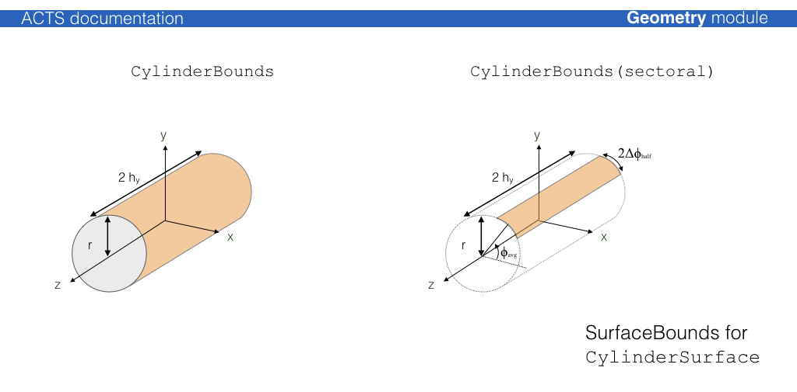
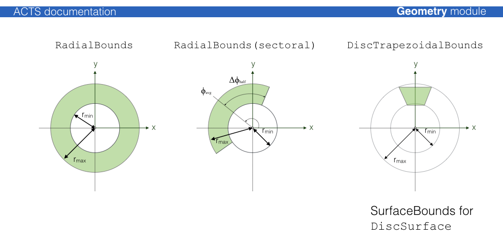

# Geometry module

The Acts geometry model is strongly based on the ATLAS Tracking geometry. Its core is built on a surface-based description that make up all geometry objects of higher complexity. This design has been chosen as the surface objects can be used together with the track propagation module and thus all geometry objects become natively integrated into the tracking software.

## GeometryObject base class and GeometryID

All geometry objects in Acts inherit from a virtual `GeometryObject` base class

    /// @class GeometryObject
    ///
    /// Base class to provide GeometryID interface:
    /// - simple set and get
    ///
    /// It also provides the binningPosition method for
    /// Geometry geometrical object to be binned in BinnedArrays
    ///
    class GeometryObject
    {
    public:
     /// default constructor
     GeometryObject() : m_geoID(0) {}
    
     /// constructor from a ready-made value
     ///
     /// @param geoID the geometry identifier of the object
     GeometryObject(const GeometryID& geoID) : m_geoID(geoID) {}
    
     /// assignment operator
     ///
     /// @param geoID the source geoID
     GeometryObject&
     operator=(const GeometryObject& geoID)
     {
       if (&geoID != this) m_geoID = geoID.m_geoID;
       return *this;
     }
    
     /// Return the value
     /// @return the geometry id by reference
     const GeometryID&
     geoID() const;
    
     /// Force a binning position method
     ///
     /// @param bValue is the value in which you want to bin
     ///
     /// @return vector 3D used for the binning schema
     virtual const Vector3D
     binningPosition(BinningValue bValue) const = 0;
    
     /// Implement the binningValue
     ///
     /// @param bValue is the dobule in which you want to bin
     ///
     /// @return float to be used for the binning schema
     double
     binningPositionValue(BinningValue bValue) const;
    
     /// Set the value
     ///
     /// @param geoID the geometry identifier to be assigned
     void
     assignGeoID(const GeometryID& geoID);
    
    protected:
     GeometryID m_geoID;
    };

This class ensures that a unique `GeometryID` is assigned to every geoemtry object. The `GeometryID` is mainly used for fast identification of the type of the geometry object (as most are either extensions or containers of the `Surface` objects) and for
the identification of the geometery surfaces after building, e.g. for the uploading/assigning of material to the surface after creation. The `GeometryID` uses a simple masking procedure for applying an identification schema.

It is used for Acts internal applications, such as material mapping, but not for `EventData` and `Geometry` identification in an experiment setup, for this the `Identifier` class is to be used and/or defined.

    typedef uint64_t geo_id_value;
    
    namespace Acts {
    
    /// @class GeometryID
    ///
    ///  Identifier for Geometry nodes - packing the
    ///  - (Sensitive) Surfaces    - uses counting through sensitive surfaces
    ///  - (Approach)  Surfaces    - uses counting approach surfaces
    ///  - (Layer)     Surfaces    - uses counting confined layers
    ///  - (Boundary)  Surfaces    - uses counting through boundary surfaces
    ///  - Volumes                 - uses counting given by TrackingGeometry

    class GeometryID
    {
    
    public:
      const static geo_id_value volume_mask    = 0xff00000000000000;
      const static geo_id_value boundary_mask  = 0x00ff000000000000;
      const static geo_id_value layer_mask     = 0x0000ff0000000000;
      const static geo_id_value approach_mask  = 0x000000f000000000;
      const static geo_id_value sensitive_mask = 0x0000000ffff00000;
      const static geo_id_value channel_mask   = 0x00000000000fffff;
    
      ...
    };
        

## Surface classes

The `Surface` class builds the core class of all geometry objects and can be used natively with the propagation and extrapolation modules. The common `Surface` virtual base defines the public interface of all surfaces. The different concrete `Surface` classes are defined by their respective native local coordiate system, while different shapes on surfaces are defined by `SurfaceBounds` classes which every surface must provide. In case of boundless surfaces, a special `InfiniteBounds` class is available.

| Surface Type | Local Coordinates | Bound Types available |
|:------------------|---------------|:------|
| `ConeSurface`     | [rphi, z] | `ConeBounds` |
| `CylinderSurface` | [r, phi] | `CylinderBounds` |
| `DiscSurface`     | [r, phi] | `RadialBounds`, `DiscTrapezoidalBounds` |
| `PlaneSurface`    | [x, y] | `RectangleBounds`, `TrapezoidalBounds`, `TriangleBounds`, `InfiniteBounds`, `EllipseBounds` |
| `PerigeeSurface`, `StrawSurface`  | [d, z] | `CylinderBounds` |

## Layer classes

The `Layer` class is an extension of the `Surface` class that allows the definition of sub surfaces (sensitive surfaces for modules, or extra material surfaces).

The Layer can simply correspond to a 'virtual' surface in the detector description or represent a more complex object that may contain:

* an array of contained surfaces
* approach surface (i.e. boundary surface of the volume occupied by the layer)
* surface material description on any surface
   
The un-occupied space in a volume which contains a layer array is filled with objects of type `NavigationLayer`, which allows that in a fully static geometry setp, every single point in a volume can be associated with a layer.

## Volume classes

The `Volume` class is a container of `BoundarySurface` objects, where each `BoundarySurface` is an extension of the `Surface` class with additional information abouit the attached Volumes. The normal vector of the surface defines an *inside* (oposite w.r.t. the normal vector) and an *outside* (along w.r.t. the normal vector) direction. Either a single volume or an array of volumes can be attached to a volume.

The simples volume class is just a collection of surfaces, where the `TrackingVolume` describes a volume that can contain:

* an array of contained layers
* an array of contained volumes (as a container volume)
* an array of contained voluems (as *floating* objects)
* a volume based material description
   
The shape of the volume is defined by `VolumeBounds` classes that create the corresponding bounding surfaces and register the attachment to the volume itself at creation.

## Building procedure and volume 'glueing'

The geometry building procedure follows the ATLAS TrackingGeometry philosophy of a static frame of *glued* volumes,
that lead the navigation flow through the geometry, 

## Material description

Two types of material description exist, one for a surface based material, one for a volume based material. They will be dealt with differently in the extrapolation.

The basic information for any material is:

* the radiation length X0 
* the nuclear interaction length L0
* the atomic weight A
* the atomic charge Z
* the density of the material
This is confined together in the `Material` class.

Surface based material extends this material information by representative thickness, the corresponding object is called `MaterialProperties`. The thickness hereby can be arbitrarily chosen in order to regulate the material budget, it does not have to represent the actual thickness of a detector element. To attach it to a surface, a dedicated `SurfaceMaterial` class (or it's extensions) is used, which allows to also describe binned material.

Possible extensions are:

 * `HomogeneousSurfaceMaterial`, homogeneous material description on a surface
 * `BinnedSurfaceMaterial`, an arbitrarily binned material description with a corresponding `BinUtility` object
 * `ProtoSurfaceMaterial`, only binning description (without material) to be used in the material mapping process

